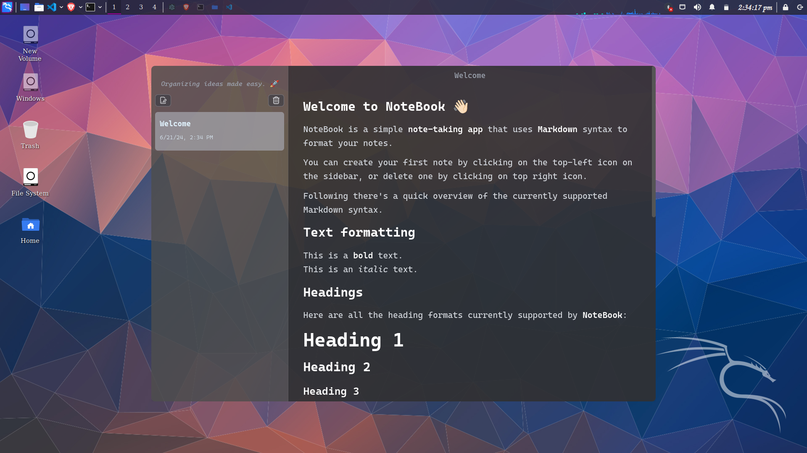

# Notebook: A Desktop Application.

Notebook is a powerful Electron application built with React and TypeScript, designed to streamline your note-taking experience. With its intuitive interface and robust features, Notebook provides a seamless platform for organizing your thoughts, ideas, and tasks.



## Getting Started

+ **Installation:** Begin by installing Notebook using the provided installation instructions.

+ **Create a Note:** Launch Notebook and start creating your first note by clicking on the `New Note` button.

+ **Organize:** Use tags and categories to organize your notes for easy retrieval.

+ **Start Writing:** Dive into the world of note-taking with Notebook and unleash your creativity.

+ **Note Storage:** Notes are stored in `~/NoteBook/` folder in makedown `.md` format.

## Successfully Tested on:
+ Kali Linux - `2024.2 (Linux-6.8.11-amd64)`
+ Arch Linux - `x86_64 (6.9.5-arch1-1)`
+ Ubuntu - `24.04 LTS`
+ Windows 11 

## Download NoteBook
### For [Debian Based](https://github.com/akash2061/NoteBook/releases/tag/v1.0.0-Linux): 
+ [Setup (.deb)](https://github.com/akash2061/NoteBook/releases/download/v1.0.0-Linux/NoteBook_1.0.0_amd64.deb) 
+ [Setup (.snap)](https://github.com/akash2061/NoteBook/releases/download/v1.0.0-Linux/NoteBook_1.0.0_amd64.snap) 
### For [Arch Linux](https://github.com/akash2061/NoteBook/releases/tag/v1.0.0-Linux): 
+ [Setup (.pacman)](https://github.com/akash2061/NoteBook/releases/download/v1.0.0-Linux/NoteBook-1.0.0.pacman) 
#### Note: Navigate to downloads folder & run:
#### For .pacman:
```bash
sudo pacman -U NoteBook_1.0.0.pacman 
```
#### For .deb:
```bash
sudo dpkg -i NoteBook_1.0.0_amd64.deb 
```
#### For .snap:
```bash
sudo snap install --dangerous NoteBook_1.0.0_amd64.snap
```
### For [Windows](https://github.com/akash2061/NoteBook/releases/tag/v1.0.0): 
+ [Setup](https://github.com/akash2061/NoteBook/releases/download/v1.0.0/notebook-1.0.0-setup.exe)
+ [Pre-installed]()

## Project Setup:

### Clone Repo. or Download [.ZIP](https://github.com/akash2061/NoteBook/archive/refs/heads/master.zip)

```bash
$ git clone https://github.com/akash2061/NoteBook.git
```
### Install
```bash
$ npm install
```

### Development

```bash
$ npm run dev
```


## Contributing

I encourage contributions from the community to help make Notebook even better. Whether it's bug fixes, feature enhancements, or documentation improvements, every contribution is valuable.

## License
Notebook is released under the [MIT License](LICENSE). By using this application, you agree to the terms and conditions outlined in the license agreement.