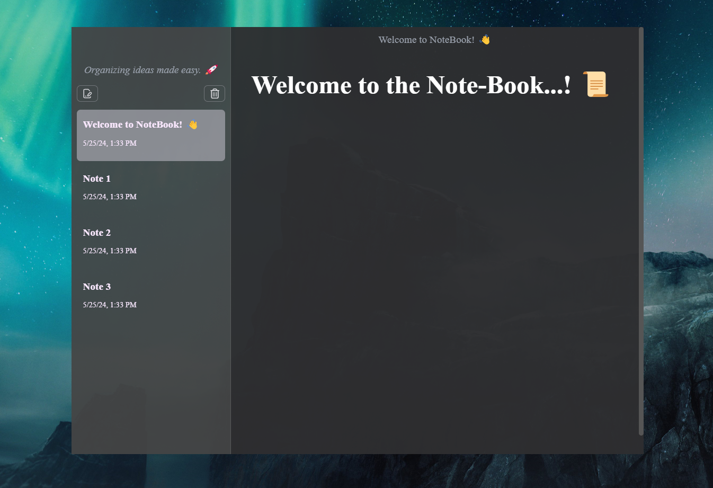

# Notebook: A Desktop Application.

Notebook is a powerful Electron application built with React and TypeScript, designed to streamline your note-taking experience. With its intuitive interface and robust features, Notebook provides a seamless platform for organizing your thoughts, ideas, and tasks.



## Project Setup

### Install

```bash
$ npm install
```

### Development

```bash
$ npm run dev
```

### Build

```bash
# For windows
$ npm run build:win

# For macOS
$ npm run build:mac

# For Linux
$ npm run build:linux
```

## Getting Started

+ **Installation:** Begin by installing Notebook using the provided installation instructions.

+ **Create a Note:** Launch Notebook and start creating your first note by clicking on the "New Note" button.

+ **Organize:** Use tags and categories to organize your notes for easy retrieval.

+ **Start Writing:** Dive into the world of note-taking with Notebook and unleash your creativity.

## Contributing

We encourage contributions from the community to help make Notebook even better. Whether it's bug fixes, feature enhancements, or documentation improvements, every contribution is valuable.

## License
Notebook is released under the [MIT License](LICENSE). By using this application, you agree to the terms and conditions outlined in the license agreement.